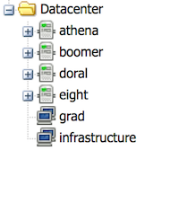

Hypervisors/Proxmox
=======

Overview
---------

Our infrastructure is quite virtualized and we're using Proxmox to create/maintain the virtual machines across a number of hosts. The hosts currently serving KVM-based virtual machines from proxmox are:

  * `athena.ohmage.org`
  * `boomer.ohmage.org`
  * `doral.ohmage.org`
  * `eight.ohmage.org`

These hosts server the Proxmox web ui from port 8006 and https (in order to visit one, have a CENS-based IP address and visit https://doral.ohmage.org:8006/). The web ui is served from all nodes, and thus in the event of a node failure, can be accessed from a live node.

Log in
----------

While a complete discussion of proxmox management and maintenance is better handled by [proxmox](http://proxmox.com) resources, here a few things that might be useful.

  * When logging in, ensure "Proxmox VE Authenication Server" is the selected realm (unless the sky is falling, you may use "Linux PAM" and the server's root pw)
  * After logging in, all nodes should be listed on the left (red lights mean the node is not currently part of the cluster): 

Instance Management
--------------------

Instances can be halted from the interface by clicking on the particular instance and using the accessor buttons on the top right of the interface.  `Shutdown`, `Reset` and `Start` are preferred, while `Stop` essentially issues a 'power plug pull' on the given instance.  The instance can be removed from this interface after being stopped by clicking `Remove`. Please ensure you **actually** want to forever **delete** this instance before clicking remove. You can also use `Console` to connect to that instance's console window. Prior to promox 3.3 java was necessary to run the console window.

Instances can also be snapshot (or rolled back to a previous snapshot) under the Snapshot tab. `Take Snapshot` initiates a snapshot, selecting an existing and clicking `Rollback` will rollback to that instance.  **ANY DATA CREATED BETWEEN THE CURRENT TIME AND THE ROLLBACK SNAPSHOT TIME WILL BE GONE FOREVER**.

The hardware tab will show the current hardware specs.  If additional CPU or Memory is needed, these values can be modified and will be reflected after the instance is completely shut off and turned back on (a simple `Reset` will not suffice).  If additional disk space is needed, add an additional disk and extend the LVM parition within the instance's OS.

The options tab can be used to modify the instance name and whether or not the instance will start during the boot of the physical host.  In general, all instances should be started at boot.

Instance Creation
-----------------

Instances can be created by clicking `Create VM` at the top right of the window.  You'll need to specify a few items:

  * General
    * Node: which node to run the guest on.
    * VM ID: a unique id for this instance. In general, use 1xx ids for production, 9xx for temp, 2xx for unimportant
    * Name: name for the instance, this does not translate to the node's `FDQN`, but it's best to use that.
    * Resource Pool: unused in our cluster
  * OS: Linux 3.x/2.6 Kernel unless a specific reason is known (eg. Windows).
  * CD/DVD
    * Storage: `starbuck`
    * ISO Image: select the one you want (at the time of writing, probably `Ubuntu 14.04`)
  * Hard Disk
    * Bus/Device: VIRTIO `{count}`
    * Storage: local
    * Disk size: need dependent, generally `>=20GB`
  * CPU
    * Sockets: set as needed
    * Cores: set as needed
  * Memory
    * Set as needed. note: MB value must be specified, so 4GB ram requires value set to `4096`
  * Network
    * Leave as default, NAT

The instance will be created as off. Please turn on, load up the console and walk through the OS setup process.

Adding Storage to an Instance
------------------------------

As instances have been created with LVM-backed disks, storage can be extended arbitrarily for any instance. The safest way to do this is via the process dictated here.

  * Begin in proxmox by selecting a virtual machine and clicking the "hardware" tab.
  * On the hardware tab, click "Add" and select "Hard Disk".
    * Use VIRTIO as the driver (it should autoincrement the device num, but take note of it, we'll need it later)
    * Use "local" for storage unless you have a good reason (you don't).
    * Select your disk size and click "Add".
  * When performing these actions on proxmox 3.3 and ubuntu 12.04, not even rebooting the instance was enough, I needed to power off an back on the instance. ugh.
  * After the disk is available in the instance, perform these actions to extend the lv:
    * `fdisk /dev/vdb` "b" here is the device num from above as alpha.
    * After each prompt in the fdisk util type the code here and then hit enter:
      * `n`
      * `<enter>` (default: p)
      * `<enter>` (default: 1)
      * `<enter>` (default: First cylinder)
      * `<enter>` (default: Last cylinder)
      * `t`
      * `8e` (for Linux LVM)
      * `w` (writes changes and exits)
    * `pvcreate /dev/vdb1` will make the disk available for use in LVM
    * `vgdisplay` will look up the volume group we need to add it to (ex: `lausd`)
    * `vgextend lausd /dev/vdb1` adds our disk to the volume group
    * `lvdisplay` will look up the logical volume we want to add it to (ex: `/dev/lausd/root`)
    * `lvextend /dev/lausd/root /dev/vdb1` extends the lv to include our new disk.
    * `resize2fs /dev/lausd/root` will finally extend our partition for usage. check `df` to confirm!

Reviewing Instance Backup Policy
---------------------------------

Much of our data is being backed up within the instances, but some instances continue to have full instance backups done via the policy listed on the Backup tab (click the `Datacenter` directory on the left). Policies can be handled per-node or for the entire cluster, and backup at a given time on X days of the week. Only nodes selected via these policies will have instance backups available on the storage server.
